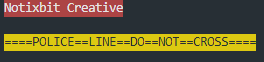

# Notixbit C++ Utility Library (NTB++)

NTB++ is a header-only utility library for C++ >= 17.

It includes Colors, Templates & Types.
Useful for printing colors, ``std::map`` and ``std::vector`` into ``std::cout``.<br>
A couple of common typealiases (typedefs) like ``String``, ``UInt``, ``StringMap``, ``StringMapOf<Type>`` are included as well.<br>

Motivation:

We developed this lib as part of a program for a customer,<br>
and we figured it might benefit other developers too.

## Table of contents

- [Namespaces](#namespaces)
    - [Ntb](#ntb)
    - [Ntb::Types](#ntbtypes)
    - [Ntb::Templates](#ntbtemplates)
    - [Ntb::Colors](#ntbcolors)
- [Build/Include](#buildinclude)
- [Usage (Ntb::Colors)](#usage-ntbcolors)
- [Documentation](https://notixbit.github.io/ntbpp/namespaces.html)
- [Roadmap](#roadmap)
- [Contributing](#contributing)
- [License](#license)

---

## Namespaces

### ``Ntb``

```cpp
using namespace Ntb;
```

Exposes the following namespaces:

```cpp
namespace Ntb::Types
namespace Ntb::Templates
namespace Ntb::Colors
```

---

### ``Ntb::Types``

```cpp
using namespace Ntb::Types;
```

Exposes the following types:

```cpp
using Bool
using Char
using UChar
using Short
using UShort
using Int
using UInt
using Long
using LongLong
using ULong
using ULongLong
using String
using MapOf<Type,Type2>
using StringMapOf<Type>
using StringMap
using Vector<Type>
```

---

### ``Ntb::Templates``

```cpp
using namespace Ntb::Templates;
```

Exposes the following templates:

```cpp
/**
 * Overloads the '<<' cout operator to recognize vectors.
 *
 * @param The vector of type <T>.
 * @return ostream.
 */
std::ostream &operator<<(std::ostream &os, const Vector<T> &v)
/**
 * Overloads the '<<' cout operator to recognize maps.
 * 
 * Prints a newline for all elements but the last.
 *
 * @param The map of type <T,U>.
 * @return ostream.
 */
std::ostream &operator<<(std::ostream &os, const MapOf<T,U> &v)
```

> ``Ntb::Templates`` makes use of ``Ntb::Types`` and exposes it.

---

### ``Ntb::Colors``

```cpp
using namespace Ntb::Colors;
```

Exposes the following utilities for coloring ``std::cout`` output:

```cpp
enum Colors : const UInt
/** Color helpers (optional) */
const UInt Colors::RESET
const UInt Colors::BLACK
const UInt Colors::RED
const UInt Colors::GREEN
const UInt Colors::YELLOW
const UInt Colors::BLUE
const UInt Colors::MAGENTA
const UInt Colors::CYAN
const UInt Colors::WHITE
/**
 * Color marker for foreground/background.
 *
 * @param color The color code.
 * @return String with color marker.
 */
const String col(const UInt color = Colors::RESET)
/**
 * Color marker for foreground, background and text.
 *
 * @param str The input text.
 * @param front The foreground color code.
 * @param back The background color code.
 * @return Encapsulated string with color markers.
 */
const String col(const String str, const UInt front, UInt back = Colors::RESET)
```

> ``Ntb::Colors`` makes use of ``Ntb::Types`` and exposes it.

---

## Build/Include

Just clone this repo into your thirdparty (or lib or includes) folder,<br>
and instruct your compiler to include it. You could also add it as a submodule.

Specs:

Min Std: **C++17** <br />
(Structured bindings, inline, Nested namespaces)

Tested against OS:

- Linux 4.14.154 Ubuntu 18.04.4 LTS x86_64 (Bionic Beaver)
- Windows 7 Home Premium SP1 64 bit
- Windows 10 Home

Tested against Compiler:

- clang 9.0.0


```
git clone <url> thirdparty
```

or

```
git submodule add <url> thirdparty
```

Include via ``INCLUDES`` flags (in Makefile etc):

```
INCLUDES = -Ithirdparty/notixbit
```

Or via commandline:

```
clang++ -O1 -std=c++17 -pedantic -Ithirdparty/notixbit
```

---

## Usage (``Ntb::Colors``)

```cpp
#include <notixbit.h>
using namespace Ntb::Colors;

std::cout 
  << col("Notixbit Creative", Colors::WHITE, Colors::RED) 
  << std::endl << std::endl 
  << col("====POLICE==LINE==DO==NOT==CROSS====", Colors::BLACK, Colors::YELLOW) 
  << std::endl << std::endl;
```

Result:



---

## Roadmap

+ Tests
+ CI

---

## Contributing

You're very welcome and free to contribute. Thank you.

---

## License

[MIT](LICENSE)
